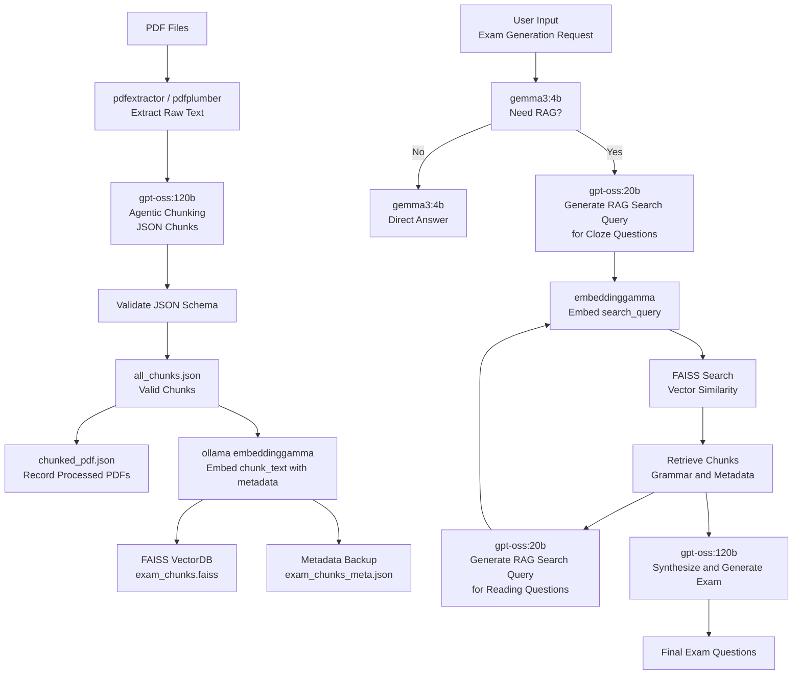

# 📘 QuizForgeTW (English Version)


**Effortlessly generate Taiwanese high school–style English exam questions using agentic RAG technology. From PDF archives to ready-to-use questions, ExamRAG brings intelligence, context, and exam expertise into one pipeline.**

### ✨ Key Features

- **🧠 Agentic RAG Intelligence**
  Automatically decides whether to retrieve relevant content before generating questions—no wasted prompts, no irrelevant material.

- **📄 Exam-Aware Semantic Chunking**
  Large language models intelligently chunk PDF content based on exam structure and context, not arbitrary fixed sizes.

- **📚 Grammar & Exam Style–Focused Retrieval**
  Retrieves questions matching semantic intent, grammar focus, and closely emulates Taiwanese junior & senior high exam formats.

- **📝 Realistic Exam Question Generation**
  Supports cloze, grammar, and reading comprehension questions—all generated to resemble authentic Taiwanese school exams.

- **⚡ Offline Indexing, Instant Online Generation**
  Heavy embedding and indexing are done offline for lightning-fast and stable online question generation.

---

## 🧠 Models Used

| Purpose                        | Model                     |
| ------------------------------ | ------------------------- |
| Chunking & Exam Synthesis      | `gpt-oss:120b` (ncku)     |
| RAG Query Generation           | `gpt-oss:20b` (ncku)      |
| Lightweight Decision & Control | `gemma3:4b` (ncku)        |
| Text Embedding                 | `embeddinggemma` (Ollama) |
| Vector Database                | FAISS                     |

---

## 🏗️ How It Works (High-Level)



---

## 🚀 Quick Start (Linux)

### 0. Requirements

- Python 3.12
- [Ollama](https://ollama.com/) (must be installed)
- Ollama Model: `embeddinggamma`

```bash
curl -fsSL https://ollama.com/install.sh | sh
ollama pull embeddinggamma
ollama serve
```

### 1. Install Dependencies

```bash
# Optional: Create a virtual environment
python3 -m venv venv
source venv/bin/activate  # Linux / Mac
pip install -r requirements.txt
```

### 2. Environment Variables

Create a `.env` file in the project root and add your API key:

```env
# .env
API_KEY=your_api_key_here
```

### 3. Prepare PDFs

```bash
cd pdf
# Place exam PDFs into ./pdf directory
```

### 4. Offline Chunking & Indexing

```bash
# Chunk PDFs and organize content
python3 chunking.py

# Build vector embeddings
python3 embedding.py
```

### 5. Run the Agent (Server Mode)

```bash
# Start FastAPI / Uvicorn server
uvicorn server:app --host 0.0.0.0 --port 8000
```

- Open a browser and visit: [http://localhost:8000](http://localhost:8000)
- Use the frontend to enter a prompt and interact with the agent.

---

## 📂 Project Structure

```bash
.
├── pdf/                    # Raw exam PDFs
├── prompts/                # Prompt templates
├── json/                   # Chunk & metadata outputs
├── exam_chunks.faiss       # FAISS index
├── chunking.py             # Offline chunking
├── embedding.py            # Offline embedding
├── agent.py                # Generate exam questions
├── utils.py
├── server.py               # Localhost web server
```
