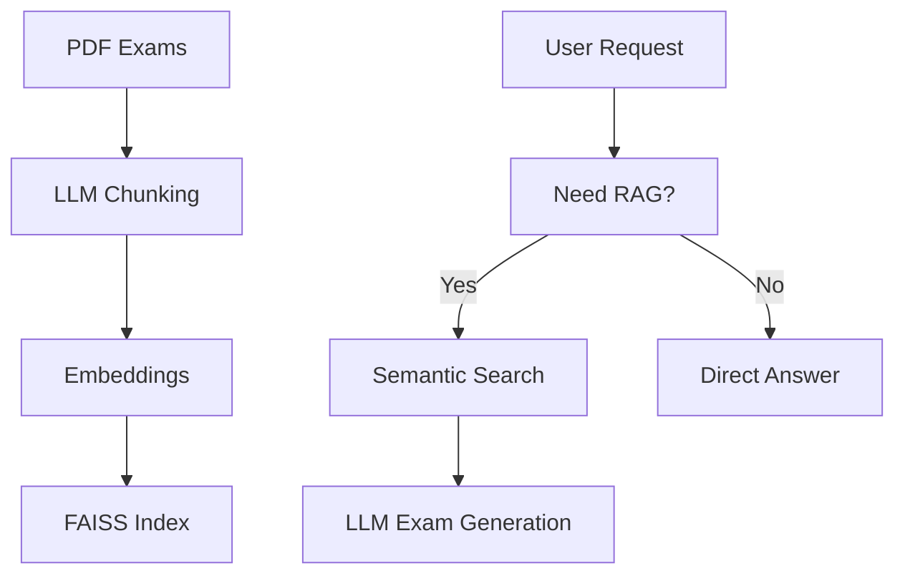

# 📘 ExamRAG

> An agentic Retrieval-Augmented Generation (RAG) system for generating English exam questions from PDF exam archives.

---

## ✨ Key Features

- **Agentic RAG Decision**
  - Automatically decides whether retrieval is needed before generation

- **LLM-based Semantic Chunking**
  - Uses large language models to produce exam-aware, structured chunks (not fixed-size splits)

- **Grammar-Aware Retrieval**
  - Retrieves questions by semantic intent and grammar focus, not keywords

- **Exam-Type Specific Search**
  - Separately retrieves cloze questions and reading comprehension passages

- **Offline Indexing, Online Generation**
  - Heavy processing is done offline for fast and stable online inference

## 🧠 Models Used

| Purpose                        | Model                     |
| ------------------------------ | ------------------------- |
| Chunking & exam synthesis      | `gpt-oss:120b`            |
| RAG query generation           | `gpt-oss:20b`             |
| Lightweight decision & control | `gemma3:4b`               |
| Text embedding                 | `embeddinggemma` (Ollama) |
| Vector database                | FAISS                     |

---

## 🏗️ How It Works (High-Level)



---

## 🚀 Quick Start

### 1. Prepare PDFs

```bash
mkdir pdf
# put exam PDFs into ./pdf
```

### 2. Offline Chunking & Indexing

```bash
python offline_chunking.py
python embedding.py
```

### 3. Run the Agent

```python
from agent import agent_answer

for output in agent_answer("Generate a junior high cloze test on prepositions"):
    print(output)
```

---

## 📂 Project Structure

```bash
.
├── pdf/                    # Raw exam PDFs
├── prompts/                # Prompt templates
├── json/                   # Chunk & metadata outputs
├── exam_chunks.faiss       # FAISS index
├── chunking.py             # Offline Chunking
├── embedding.py            # Offline Embedding
├── agent.py                # Generate exam questions
├── utils.py
├── server.py               # localhost web server
```
