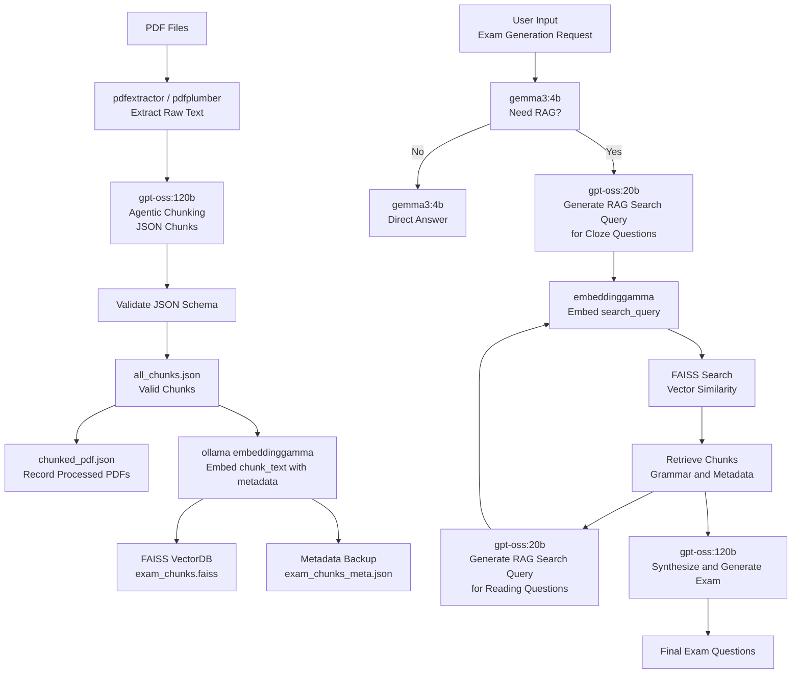

# 📘 QuizForgeTW

**Generate Taiwanese high school–style English exam questions effortlessly using agentic RAG technology. From PDF archives to ready-to-use questions, ExamRAG brings intelligence, context, and exam expertise into one pipeline.**

### ✨ Why It’s Awesome

- **🧠 Agentic RAG Intelligence**
  Automatically decides whether to retrieve relevant content before generating questions—no wasted prompts, no irrelevant material.
- **📄 Exam-Aware Semantic Chunking**
  Large language models intelligently chunk PDF content based on exam structure and context, not arbitrary fixed sizes.
- **📚 Grammar & Exam Style Focused Retrieval**
  Finds questions that match semantic intent, grammar focus, and closely emulate Taiwanese junior & senior high exam formats.
- **📝 Realistic Exam-Type Generation**
  Supports cloze, grammar, and reading comprehension questions—all generated to resemble authentic 國中段考、模擬考題.
- **⚡ Offline Indexing, Instant Online Generation**
  Heavy embedding and indexing are done offline for lightning-fast and stable online question generation.

## 🧠 Models Used

| Purpose                        | Model                     |
| ------------------------------ | ------------------------- |
| Chunking & exam synthesis      | `gpt-oss:120b`(ncku)      |
| RAG query generation           | `gpt-oss:20b`(ncku)       |
| Lightweight decision & control | `gemma3:4b`(ncku)         |
| Text embedding                 | `embeddinggemma` (Ollama) |
| Vector database                | FAISS                     |

## 🏗️ How It Works (High-Level)



## 🚀 Quick Start (For Linux)

### 0. Requirements

- Python 3.12
- [Ollama](https://ollama.com/) (需先安裝)
- Ollama 模型：`embeddinggamma`

  ```bash
  curl -fsSL https://ollama.com/install.sh | sh
  ollama pull embeddinggamma
  ollama serve
  ```

### 1. Install Dependencies

```bash
# 建立虛擬環境（可選）
python3 -m venv venv
source venv/bin/activate  # Linux / Mac
pip install -r requirements.txt
```

### 2. 🔑 Environment Variables

建立一個 `.env` 檔案在專案根目錄，填入你的 API Key，例如：

```env
# .env
API_KEY=your_api_key_here
```

### 3. Prepare PDFs

```bash
cd pdf
# 將考卷 PDF 放入 ./pdf 目錄
```

### 4. Offline Chunking & Indexing

```bash
# 將 PDF 分段 / 整理
python3 chunking.py

# 建立向量嵌入
python3 embedding.py
```

### 5. Run the Agent (Server Mode)

```bash
# 啟動 FastAPI / Uvicorn server
uvicorn server:app --host 0.0.0.0 --port 8000
```

- 開啟瀏覽器，訪問：[http://localhost:8000](http://localhost:8000)
- 使用前端介面輸入 prompt 開始互動

## 📂 Project Structure

```bash
.
├── pdf/                    # Raw exam PDFs
├── prompts/                # Prompt templates
├── json/                   # Chunk & metadata outputs
├── exam_chunks.faiss       # FAISS index
├── chunking.py             # Offline Chunking
├── embedding.py            # Offline Embedding
├── agent.py                # Generate exam questions
├── utils.py
├── server.py               # localhost web server
```
