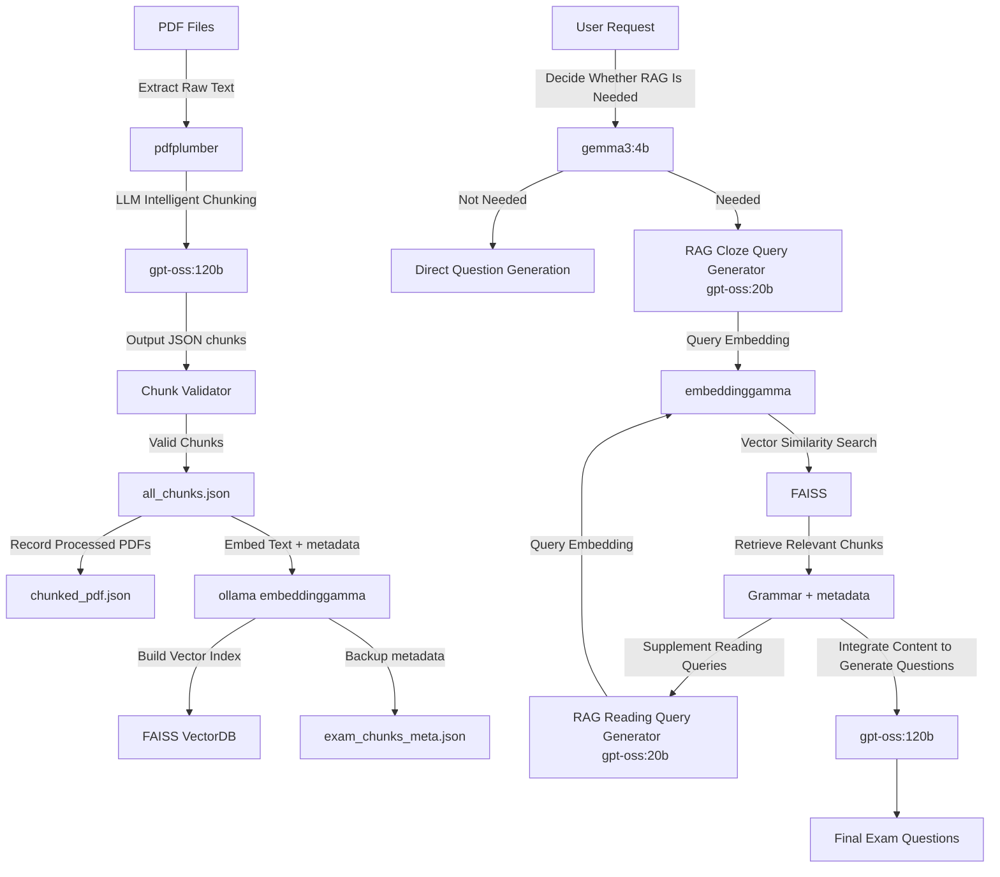

# 📘 QuizForgeTW

[Chinese Version](/README.md)


**Using agentic RAG technology to effortlessly generate Taiwan-style high school English exam questions. From PDF exam papers to ready-to-use questions, QuizForgeTW integrates intelligence, context, and exam expertise into a single streamlined workflow.**

### ✨ Key Features

- **🧠 Intelligent RAG Decision**
  The system automatically determines whether retrieval is necessary before generation—avoiding wasted prompts or irrelevant information.

- **📄 Exam-Aware Semantic Chunking**
  Uses LLMs to segment content based on exam structure and context, rather than arbitrary fixed-size splits.

- **📚 Grammar- and Exam-Style Retrieval**
  Precisely retrieves questions that match semantic intent and grammatical focus, closely aligned with Taiwan junior and senior high school exam styles.

- **📝 Realistic Exam Question Generation**
  Supports cloze tests, grammar questions, and reading comprehension—generated questions are highly similar to real exams.

- **⚡ Offline Indexing, Online Real-Time Generation**
  All embedding and indexing work is completed offline, enabling fast and stable online question generation.

### 📔 Exam Discriminative Power

Please refer to Question 8 in the [Sample Questions](./demo_output.pdf).  
If a student believes that both options (A) and (B) are correct,  
it indicates that the student has not yet mastered the concept of **non-restrictive relative clauses**.

> Since the question generation process heavily incorporates historical exam archives, the system is able to test students on the **classic trap questions** commonly found in Taiwan junior and senior high school exams.


## 🧠 Models Used

| Purpose               | Model                     |
| --------------------- | ------------------------- |
| Chunking & Generation | `gpt-oss:120b` (ncku)     |
| RAG Query Generation  | `gpt-oss:20b` (ncku)      |
| Lightweight Control   | `gemma3:4b` (ncku)        |
| Text Embedding        | `embeddinggemma` (Ollama) |
| Vector Database       | FAISS                     |

## 🏗️ System Workflow Overview



## 🚀 Quick Start (Linux)

### 0. System Requirements

- Python 3.12
- [Ollama](https://ollama.com/) (must be installed)
- Ollama model: `embeddinggamma`

```bash
curl -fsSL https://ollama.com/install.sh | sh
ollama pull embeddinggamma
ollama serve
```

### 1. Install Dependencies

```bash
# Optional: create a virtual environment
python3 -m venv venv
source venv/bin/activate  # Linux / Mac
pip install -r requirements.txt
```

### 2. Environment Variables

Create a `.env` file in the project root directory and fill in the API Key:

```env
# .env
API_KEY=your_api_key_here
```

### 3. Prepare PDFs

```bash
cd pdf
# Put exam PDF files into ./pdf
```

### 4. Offline Chunking & Indexing

```bash
# PDF chunking and organization
python3 chunking.py

# Build vector embeddings
python3 embedding.py
```

### 5. Start the Agent (Server Mode)

```bash
# Start FastAPI / Uvicorn server
uvicorn server:app --host 0.0.0.0 --port 8000
```

- Open a browser and visit: [http://localhost:8000](http://localhost:8000)
- Enter prompts in the frontend to start interacting.

## 📂 Project Structure

```bash
.
├── pdf/                    # Original exam PDFs
├── prompts/                # Prompt templates
├── json/                   # Chunk and metadata outputs
├── exam_chunks.faiss       # FAISS index
├── chunking.py             # Offline chunking
├── embedding.py            # Offline embedding
├── agent.py                # Question generation
├── utils.py
├── server.py               # Local web server
```
