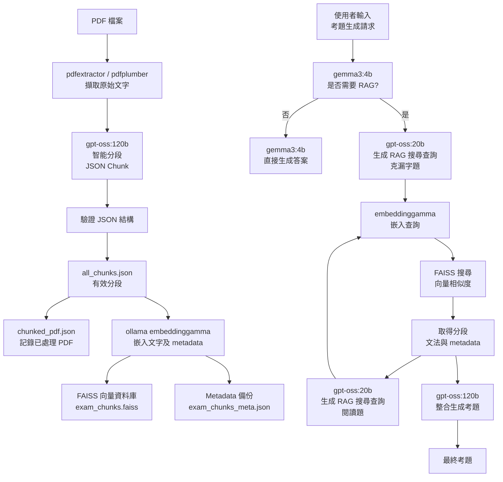

# 📘 QuizForgeTW (中文版)

**使用 agentic RAG 技術，輕鬆生成臺灣高中風格的英文考題。從 PDF 考卷檔案到可直接使用的題目，ExamRAG 將智慧、語境與考試專業整合於一個流程中。**

### ✨ 特色功能

- **🧠 智能 RAG 決策**
  系統會自動判斷是否需要檢索相關內容，再生成題目—避免浪費 prompt 或取得無關資料。

- **📄 考試感知語意分段**
  使用 LLM 根據考卷結構與語境分段，而非任意固定大小。

- **📚 文法與考試風格檢索**
  精準找出符合語意、文法重點的題目，貼近臺灣國中、高中考試風格。

- **📝 真實感考題生成**
  支援克漏字、文法、閱讀理解題目—生成的題目與真實考試高度相似。

- **⚡ 離線索引、線上即時生成**
  嵌入與索引工作全部離線完成，線上生成題目快速穩定。

---

## 🧠 使用模型

| 用途             | 模型                      |
| ---------------- | ------------------------- |
| 分段與考題生成   | `gpt-oss:120b` (ncku)     |
| RAG 搜尋查詢生成 | `gpt-oss:20b` (ncku)      |
| 輕量決策與控制   | `gemma3:4b` (ncku)        |
| 文本嵌入         | `embeddinggemma` (Ollama) |
| 向量資料庫       | FAISS                     |

---

## 🏗️ 系統流程概覽



---

## 🚀 快速開始 (Linux)

### 0. 系統需求

- Python 3.12
- [Ollama](https://ollama.com/) (需安裝)
- Ollama 模型：`embeddinggamma`

```bash
curl -fsSL https://ollama.com/install.sh | sh
ollama pull embeddinggamma
ollama serve
```

### 1. 安裝依賴

```bash
# 可選：建立虛擬環境
python3 -m venv venv
source venv/bin/activate  # Linux / Mac
pip install -r requirements.txt
```

### 2. 環境變數

建立 `.env` 檔案於專案根目錄，並填入 API Key：

```env
# .env
API_KEY=your_api_key_here
```

### 3. 準備 PDF

```bash
cd pdf
# 將考卷 PDF 放入 ./pdf
```

### 4. 離線分段與索引

```bash
# PDF 分段整理
python3 chunking.py

# 建立向量嵌入
python3 embedding.py
```

### 5. 啟動代理 (Server 模式)

```bash
# 啟動 FastAPI / Uvicorn 伺服器
uvicorn server:app --host 0.0.0.0 --port 8000
```

- 開啟瀏覽器並訪問：[http://localhost:8000](http://localhost:8000)
- 使用前端輸入 prompt 開始互動。

---

## 📂 專案結構

```bash
.
├── pdf/                    # 原始考卷 PDF
├── prompts/                # Prompt 模板
├── json/                   # Chunk 與 metadata 輸出
├── exam_chunks.faiss       # FAISS 索引
├── chunking.py             # 離線分段
├── embedding.py            # 離線嵌入
├── agent.py                # 考題生成
├── utils.py
├── server.py               # 本地 Web Server
```
